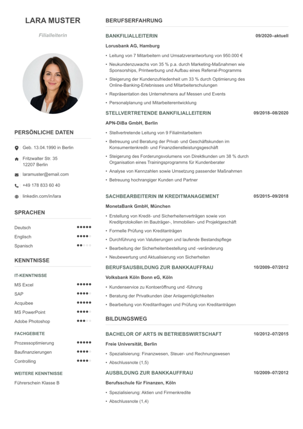

# Lebenslauf

A compact German `Lebenslauf` template for job applications, built with Typst.



## Quick Start

Install Typst 0.14.1 or newer, then compile the included example:

```sh
typst compile main.typ main.pdf
```

After publication to Typst Universe, create a new CV with:

```sh
typst init @preview/lebenslauf:0.1.0 my-cv
cd my-cv
typst compile main.typ main.pdf
```

Edit `main.typ` to replace the sample data and `profile.jpg` to use your own profile image.

All names, contact details, employers, projects, and CV content in the example are fictional.

## Template Usage

The template exposes a `cv-doc` show rule. The generated template in `template/main.typ` imports the published package; the repository example imports `lib.typ` directly for local development.

```typst
#import "@preview/lebenslauf:0.1.0": *

#show: doc => cv-doc(
  profile: cv-profile(
    "Mira Beispiel",
    [Projektkoordinatorin Operations],
    image-path: "profile.jpg",
  ),

  personal: [
    #cv-contact-row("mail", [mira.beispiel\@email.de])
    #cv-contact-row("phone", [+49 171 234 56 78])
  ],

  languages: [
    #cv-rating-row("Deutsch", 5)
    #cv-rating-row("Englisch", 4)
  ],

  knowledge: [
    #cv-rating-group([IT-Kenntnisse], (
      (label: "MS Excel", value: 5),
      (label: "SAP", value: 4),
    ))
  ],

  main: [
    #cv-section([Berufserfahrung])
    #cv-entry(
      "Projektkoordinatorin Operations",
      [Nordstadt Services GmbH, Leipzig],
      [04/2021-aktuell],
      bullets: (
        [Koordination bereichsübergreifender Verbesserungsprojekte],
        [Aufbau eines monatlichen Kennzahlenberichts],
      ),
    )
  ],
)
```

## Document Title

By default, the CV starts with the applicant name instead of a generic `Lebenslauf` heading. If you prefer an explicit title, pass `title` to `cv-doc`:

```typst
#show: doc => cv-doc(
  title: [Lebenslauf],
  // ...
)
```

## Data Model

The example keeps all CV content in arrays of dictionaries. This keeps the document easy to scan and makes it simple to add, remove, or reorder sections.

Contact rows use `kind` and `body`:

```typst
#let contacts = (
  (kind: "pin", body: [Geb. 22.08.1992 in Leipzig]),
  (kind: "home", body: [Ahornweg 18 \ 04109 Leipzig]),
  (kind: "mail", body: [mira.beispiel\@email.de]),
  (kind: "phone", body: [+49 171 234 56 78]),
  (kind: "github", body: [github.com/mirabeispiel]),
  (kind: "linkedin", body: [linkedin.com/in/mirabeispiel]),
  (kind: "orcid", body: [0000-0000-0000-0000]),
  (kind: "web", body: [mira-beispiel.dev]),
)
```

Supported contact kinds are `pin`, `home`, `mail`, `phone`, `github`, `linkedin`, `orcid`, and `web`.

Experience and education entries use the same shape:

```typst
#let experience = (
  (
    title: "Projektkoordinatorin Operations",
    org: [Nordstadt Services GmbH, Leipzig],
    dates: [04/2021-aktuell],
    bullets: (
      [Koordination bereichsübergreifender Verbesserungsprojekte],
      [Vorbereitung von Entscheidungsvorlagen],
    ),
  ),
)
```

Rating rows use `label`, `value`, and an optional `total`:

```typst
#let languages-data = (
  (label: "Deutsch", value: 5),
  (label: "Englisch", value: 4, total: 5),
)
```

## Projects

The template supports an optional `Projekte` section for GitHub repositories, GitLab repositories, demos, portfolios, or other artifacts. Leave `projects` empty to hide the section.

```typst
#let projects = (
  (
    title: "Service-Reporting-Dashboard",
    description: [Fiktives Dashboard zur Auswertung von Bearbeitungszeiten und Servicequalität.],
    url: "https://github.com/mira-beispiel/service-reporting-dashboard",
    type: [GitHub],
    tech: ("Python", "Pandas", "Streamlit"),
    artifacts: (
      [Interaktiver Prototyp mit Beispieldaten],
      [Dokumentation der wichtigsten Kennzahlen und Filter],
    ),
  ),
)
```

Project fields:

- `title`: project name
- `description`: short project summary
- `url`: optional project URL
- `type`: optional fallback text shown when no URL is provided
- `tech`: optional list of technologies
- `artifacts`: optional list of deliverables, demos, papers, or documentation
- `url-max-length`: optional maximum length for printing the URL, defaults to `50`

Project URLs are rendered as clickable provider icons in the right column. GitHub, GitLab, and LinkedIn URLs use their respective icons; other URLs use a globe icon. URLs up to `url-max-length` characters are also printed below the project title.

## Public Functions

The main entry points are:

- `cv-doc(profile: none, personal: none, languages: none, knowledge: none, main: [], title: none, sidebar-width: 28%)`
- `cv-profile(name, role, image-path: none, image-size: 4.3cm)`
- `cv-section(title)`
- `cv-entry(title, org, dates, bullets: ())`
- `cv-entry-from-dict(entry)`
- `cv-project(title, description, url: none, type: none, tech: (), artifacts: (), url-max-length: 50)`
- `cv-project-from-dict(project)`
- `cv-contact-row(kind, body)`
- `cv-rating-row(label, filled, total: 5)`
- `cv-rating-group(title, items)`
- `cv-subgroup(title)`

For most CVs, edit the data arrays in `main.typ` and render entries with `cv-entry-from-dict` and `cv-project-from-dict`.

## Icons

The template uses bundled SVG icons from Font Awesome Free, so users do not need to install Font Awesome desktop fonts or additional Typst packages. The icons live in `assets/fa`.

## Repository Layout

- `typst.toml`: package metadata and Typst template configuration
- `lib.typ`: reusable template functions
- `main.typ`: local example CV data
- `template/main.typ`: template entrypoint for `typst init`
- `profile.jpg`: example profile image for local development
- `template/profile.jpg`: example profile image copied by `typst init`
- `assets/fa/*.svg`: bundled Font Awesome Free icons
- `thumbnail.png`: package thumbnail
- `CHANGELOG.md`: release notes
- `LICENSE` and `NOTICE`: license information

## Development Checks

Compile the local example:

```sh
typst compile main.typ main.pdf
```

Check the package template as Typst would see it:

```sh
mkdir -p /private/tmp/typst-packages/preview/lebenslauf/0.1.0
rsync -a --exclude .git --exclude main.pdf ./ /private/tmp/typst-packages/preview/lebenslauf/0.1.0/
typst compile --package-path /private/tmp/typst-packages template/main.typ /private/tmp/lebenslauf-template.pdf
```

Before publishing a new release, keep these values in sync:

- `version` in `typst.toml`
- package import in `template/main.typ`
- version in the `typst init` example above
- `CHANGELOG.md`

## License

Template code is licensed under MIT. The icons in `assets/fa` are from Font Awesome Free and are licensed under CC BY 4.0. See https://fontawesome.com/license/free.
